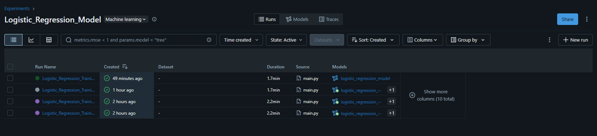
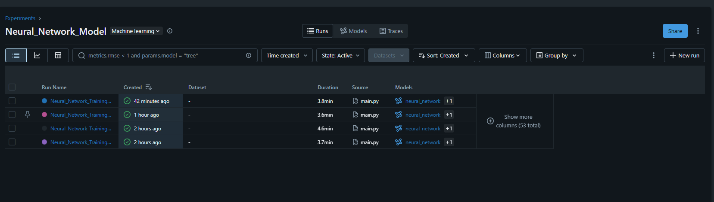
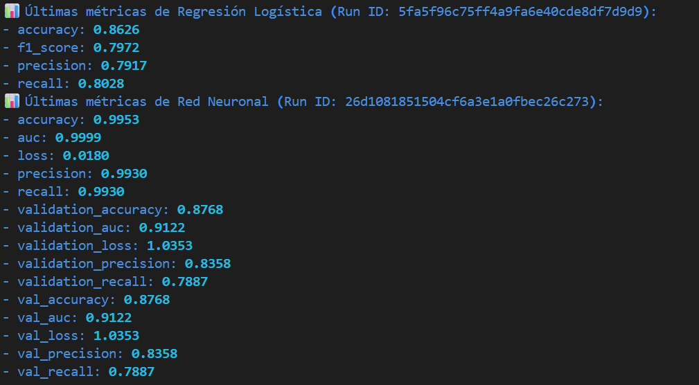
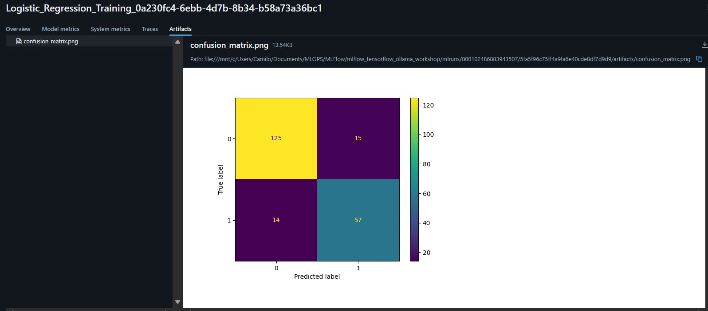
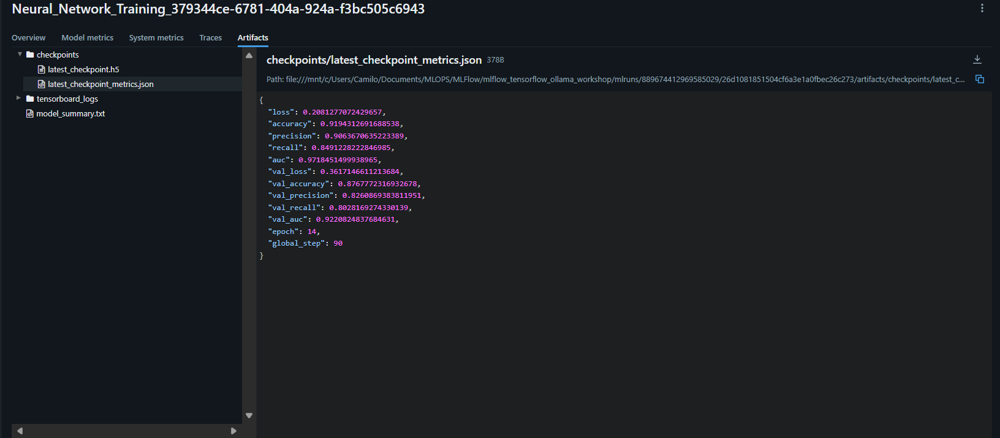
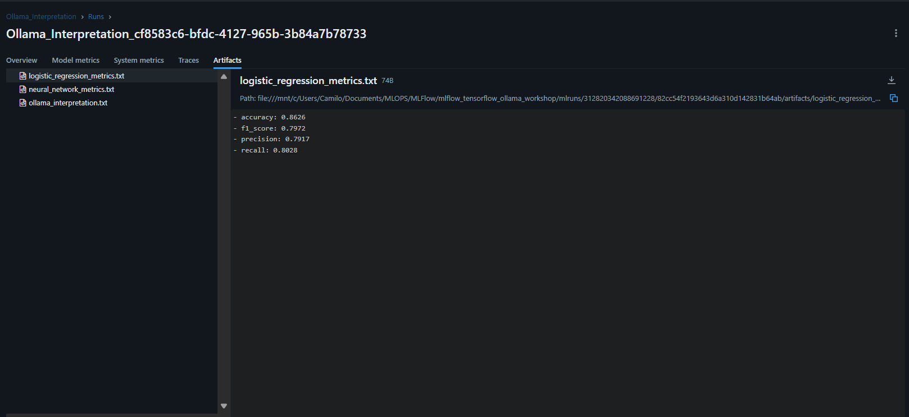

# 🧠 Proyecto: Clasificación Binaria con MLflow, TensorFlow y Ollama

Este proyecto entrena, registra y analiza dos modelos de clasificación binaria usando **MLflow** para el seguimiento de experimentos, **TensorFlow/Keras** y **Scikit-learn**.
Adicionalmente, se usa **Ollama** como asistente de interpretación para generar reflexiones automatizadas sobre los resultados.

---

## 🚀 1. Descripción general

El objetivo es comparar el rendimiento entre:

* **Modelo 1:** Regresión Logística (Scikit-learn)
* **Modelo 2:** Red Neuronal (TensorFlow)

Ambos se registran en **MLflow Tracking UI**, incluyendo métricas, artefactos, gráficos y parámetros.

---

## 📊 2. Dataset utilizado

**Dataset:** [QSAR Biodegradation (OpenML ID: 1494)](https://www.openml.org/d/1494)

* **Tamaño:** 1055 muestras
* **Características:** 41 variables moleculares (valores numéricos)
* **Variable objetivo:** `class` →

  * `RB` (readily biodegradable)
  * `NRB` (not readily biodegradable)

**Propósito:** predecir si una molécula es biodegradable según sus propiedades químicas.

---

## 🧩 3. Capturas de MLflow UI

### 🧱 Runs de ambos modelos

#### Runs de Regresión Logística



#### Runs de Red Neuronal



---

## 📈 4. Métricas comparadas



🔍 **La regresión logística** logra un rendimiento general decente, con una precisión y recall equilibrados (~0.80).
No hay señales de sobreajuste, y las métricas entre entrenamiento y validación son coherentes.
El modelo capta relaciones lineales pero no logra representar comportamientos no lineales.

🔍 **La red neuronal** alcanza casi 99.5% de exactitud y AUC de 0.9999 en entrenamiento, pero en validación baja a 0.8768 y 0.9122 respectivamente.
Esto indica **sobreajuste**, con una pérdida clara de generalización frente a nuevos datos.

---

## 📦 5. Artefactos generados

### Artefactos de Regresión Logística



### Artefactos de Red Neuronal



### Artefactos de Ollama



---

## 📄 6. Informe breve (1 página)

### 🧠 Descripción del dataset

El dataset **QSAR Biodegradation** contiene descriptores moleculares de compuestos químicos.
El objetivo es determinar si una molécula es **biodegradable (RB)** o **no biodegradable (NRB)** a partir de sus propiedades.
Se trata de un problema de clasificación binaria con variables continuas y correlaciones no lineales.

---

### 🤖 Interpretación de resultados (según Ollama)

El análisis realizado con **Ollama** arroja la siguiente interpretación:

| Métrica              | Regresión Logística | Red Neuronal | Interpretación                                              |
| -------------------- | ------------------- | ------------ | ----------------------------------------------------------- |
| **Accuracy (Train)** | 0.8626              | **0.9953**   | La red neuronal casi memoriza el conjunto de entrenamiento. |
| **Accuracy (Val)**   | 0.7887              | **0.8768**   | Mejor rendimiento general, pero con sobreajuste.            |
| **Precision (Val)**  | 0.7887              | **0.8358**   | Mejora la precisión global.                                 |
| **Recall (Val)**     | 0.6943              | **0.7887**   | Mayor cobertura en la clase positiva.                       |

📉 **Conclusión de Ollama:**

> La red neuronal supera en rendimiento a la regresión logística, pero a costa de generalización.
> Es necesario aplicar regularización, early stopping y reducción de complejidad.
> La regresión logística, aunque más simple, es más estable y explica mejor los patrones lineales.

---

### 💭 Reflexión con Ollama

> *“El modelo neuronal domina la clasificación, pero sufre de exceso de confianza: memoriza en lugar de generalizar.
> La regresión logística, aunque menos potente, ofrece interpretabilidad y consistencia.
> El equilibrio ideal podría alcanzarse mediante un modelo híbrido o mediante regularización L2 y optimización de hiperparámetros.”*
> — **Interpretación generada por Ollama**

---

## 🧾 7. Archivo de dependencias (`requirements.txt`)

```
tensorflow==2.16.1
scikit-learn==1.5.1
mlflow==2.15.1
pandas==2.2.3
numpy==1.26.4
matplotlib==3.9.2
seaborn==0.13.2
openml==0.14.2
rich==13.9.2
colorama==0.4.6
ollama==0.1.7
```

Instalación:

```bash
pip install -r requirements.txt
```

---

## 🧠 8. Conclusiones finales

* **MLflow** facilitó el seguimiento, comparación y versionado de los modelos.
* **La red neuronal** superó en métricas a la regresión logística, pero con riesgo de sobreajuste.
* **Ollama** aportó análisis interpretativo y sugerencias automáticas de mejora.
* Se completó un flujo experimental de **MLOps**: tracking, comparación y reflexión automatizada.

📚 En síntesis: se logró un pipeline reproducible que integra análisis cuantitativo y cualitativo con inteligencia artificial.

---
